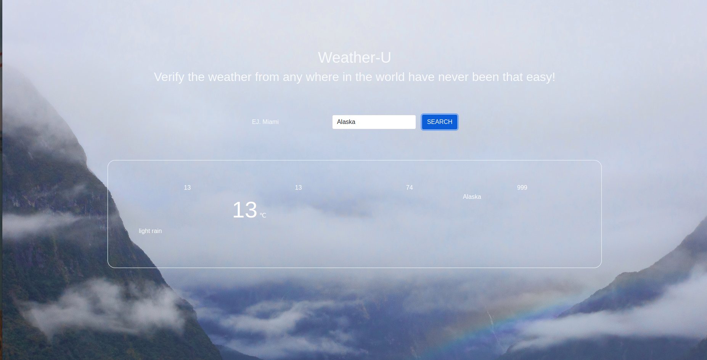

# weatherApp

This App allows a user to enter a location and receive all necesary weather forecast data .

## Built With

- HTML
- CSS
- JAVASCRIPT
- WEBPACK
- BOOTSTRAP

## Getting Started

- Open the terminal command line.
- Clone the repo:--> git clone url/ssh
- cd weatherApp
- npm install
- If you experience any issue with images or javasript try run `npm run dev`
- When you first load the app make sure you dobble click the change data scale button

## Authors

👤 **Widzmarc Jean Nesly Phelle**

- GitHub: [@widzthedvloper](https://github.com/widzthedvloper)
- Twitter: [@widzthedvloper](https://twitter.com/widzthedvloper)
- LinkedIn: [@widzthedvloper](https://www.linkedin.com/in/widzmarc-jean-nesly-phelle-252a26129/)

## 🤝 Contributing

Contributions, issues, and feature requests are welcome!

## Show your support

Give a ⭐️ if you like this project!

## Acknowledgement

- JAVASRIPT Project by Microverse.

## 📝 License

This project is [MIT](/LICENSE) licensed.
